# Architecture Overview - Tálamo Pro Hub
## Post-Hardening System Architecture

**Version**: 1.2 (Post-Security Audit)  
**Date**: September 24, 2025  
**Classification**: Internal Technical Documentation

---

## 🏗️ **SYSTEM ARCHITECTURE DIAGRAM**

```mermaid
flowchart TB
    subgraph "Client Layer"
        U[👤 User Browser]
        A[🔐 Admin Dashboard]
    end
    
    subgraph "Frontend Application"
        FE[⚛️ React + Vite App]
        FE --> R[🛣️ React Router]
        FE --> UI[🎨 Tailwind + Shadcn]
        FE --> I18N[🌍 i18n Support]
    end
    
    subgraph "Security Layer"
        MFA[🔒 2FA Component]
        AUTH[🔑 Supabase Auth]
        RLS[🛡️ Row Level Security]
    end
    
    subgraph "Supabase Backend"
        direction TB
        DB[(🗄️ PostgreSQL DB)]
        EDGE[⚡ Edge Functions]
        STORAGE[📦 Storage Buckets]
        
        subgraph "Edge Functions"
            EF1[📊 affiliation-check]
            EF2[🔐 admin-mfa-setup] 
            EF3[✅ admin-mfa-verify]
            EF4[📈 business-metrics]
        end
        
        subgraph "Database Tables"
            P[profiles]
            AU[admin_users] 
            AMF[admin_mfa]
            AL[audit_logs]
            AR[affiliation_reports]
        end
    end
    
    subgraph "External Services"
        EX[🏢 Exness Partner API]
        GA[📊 Google Analytics]
        QR[📱 QR Code Service]
    end
    
    subgraph "Monitoring & Security"
        M[📊 Business Metrics]
        L[📝 Audit Logging]
        A1[🚨 Real-time Alerts]
    end
    
    %% User flows
    U --> FE
    A --> MFA
    FE --> AUTH
    AUTH --> RLS
    
    %% API flows
    FE -.->|Secure HTTPS| EF1
    EF1 -.->|JWT Auth| EX
    EF2 --> QR
    
    %% Data flows  
    EDGE --> DB
    DB --> P
    DB --> AU
    DB --> AMF
    DB --> AL
    DB --> AR
    
    %% Monitoring flows
    EDGE --> M
    EDGE --> L
    M --> A1
    
    %% Analytics
    FE -.->|Events| GA
    
    %% Security controls
    RLS -.->|Protects| DB
    MFA -.->|Gates| A
    AUTH -.->|Secures| EDGE

    classDef security fill:#ffebee,stroke:#d32f2f,stroke-width:2px
    classDef external fill:#e3f2fd,stroke:#1976d2,stroke-width:2px
    classDef storage fill:#e8f5e8,stroke:#388e3c,stroke-width:2px
    classDef monitoring fill:#fff3e0,stroke:#f57c00,stroke-width:2px
    
    class MFA,AUTH,RLS,AMF security
    class EX,GA,QR external
    class DB,P,AU,AL,AR storage
    class M,L,A1 monitoring
```



---

## 🔐 **SECURITY ARCHITECTURE**

### Authentication & Authorization Flow


### Row Level Security (RLS) Policies
```sql
-- Example: Admin Users table
CREATE POLICY "Admin users can manage their own record"
ON admin_users FOR ALL
USING (auth.uid() = user_id OR get_current_admin_role() = 'ADMIN');

-- Example: Profiles with PII protection  
CREATE POLICY "Users see own profile, admins see masked data"
ON profiles FOR SELECT
USING (
  auth.uid() = user_id OR 
  has_admin_permission('users', 'read')
);
```

---

## 📊 **DATA ARCHITECTURE**

### Database Schema (Simplified)


### Data Flow & Security Boundaries

```mermaid
graph LR
    subgraph "Public Zone"
        FE[Frontend App]
        CDN[Static Assets]
    end
    
    subgraph "Application Zone"
        EF[Edge Functions]
        AUTH[Auth Service]
    end
    
    subgraph "Data Zone"  
        DB[(Database)]
        SECRETS[Encrypted Secrets]
    end
    
    subgraph "External Zone"
        EXNESS[Exness API]
        ANALYTICS[Analytics]
    end
    
    FE -->|HTTPS Only| EF
    EF -->|Service Role| DB
    EF -->|Encrypted| SECRETS
    EF -->|JWT Auth| EXNESS
    FE -->|Events Only| ANALYTICS
    
    %% Security boundaries
    FE -.- |"🔒 CSP Headers"| EF
    EF -.- |"🔒 RLS Policies"| DB
    EF -.- |"🔒 Rate Limits"| EXNESS
    
    classDef public fill:#e3f2fd
    classDef app fill:#e8f5e8  
    classDef data fill:#fce4ec
    classDef external fill:#fff3e0
    
    class FE,CDN public
    class EF,AUTH app
    class DB,SECRETS data
    class EXNESS,ANALYTICS external
```


---

## 🛠️ **TECHNOLOGY STACK**

### Frontend Layer
```yaml
Framework: React 18 + TypeScript
Build Tool: Vite
Styling: Tailwind CSS + Shadcn/ui
Routing: React Router v6
State: React Query + Context API
Auth: Supabase Auth SDK
i18n: react-i18next (ES/EN/PT)
Analytics: Google Analytics 4
```

### Backend Layer  
```yaml
Database: PostgreSQL (Supabase)
Runtime: Deno (Edge Functions)
Auth: Supabase Auth + Custom 2FA
Storage: Supabase Storage
Secrets: Supabase Vault
Monitoring: Built-in + Custom metrics
```

### Security Stack
```yaml
Authentication: JWT + TOTP 2FA
Authorization: RLS + RBAC
API Security: Rate limiting + CORS
Data Protection: Encryption at rest/transit
Secrets: Encrypted environment variables
Monitoring: Real-time audit logging
```

---

## ⚡ **PERFORMANCE ARCHITECTURE**

### Caching Strategy
```mermaid
graph TD
    subgraph "Browser Cache"
        SC[Static Content: 1 year]
        AC[API Responses: 5 min]
    end
    
    subgraph "CDN Cache"  
        JS[JS/CSS Bundles: 1 year]
        IMG[Images: 1 month]
    end
    
    subgraph "Application Cache"
        JWT[JWT Tokens: 8 min]
        MFA[MFA Sessions: 15 min]
        IDEM[Idempotency: 24 hours]
    end
    
    subgraph "Database Cache"
        CONN[Connection Pool: persistent]
        QUERY[Query Cache: 1 min]
    end
    
    Browser --> CDN
    CDN --> Application
    Application --> Database
    
    classDef browser fill:#e3f2fd
    classDef cdn fill:#e8f5e8
    classDef app fill:#fff3e0
    classDef db fill:#fce4ec
    
    class SC,AC browser
    class JS,IMG cdn  
    class JWT,MFA,IDEM app
    class CONN,QUERY db
```

### Scalability Patterns
```yaml
Frontend:
  - Static asset CDN distribution
  - Code splitting by route
  - Lazy component loading
  - Service worker caching

Backend:
  - Horizontal Edge Function scaling
  - Database connection pooling  
  - Read replica support (future)
  - Multi-region deployment (future)

Security:
  - Rate limiting with distributed state
  - JWT token caching
  - MFA session management
  - Audit log partitioning
```

---

## 🔄 **INTEGRATION ARCHITECTURE**

### External API Integration


### Monitoring & Observability
```yaml
Business Metrics:
  - NSM: Active traders (30-day rolling)
  - ARPT: Average revenue per trader
  - R30/R90: Retention cohort analysis
  - CAC/LTV: Customer acquisition metrics

Technical Metrics:
  - API latency (avg, p95, p99)
  - Error rates by endpoint
  - Rate limit hit rates
  - Database connection health

Security Metrics:
  - Failed authentication attempts
  - 2FA bypass attempts
  - Suspicious access patterns
  - Audit log completeness
```

---

## 🏛️ **DEPLOYMENT ARCHITECTURE**

### Environment Strategy
```yaml
Development:
  URL: localhost:5173
  Database: Local Supabase
  Features: All flags enabled
  Secrets: Development values

Staging:  
  URL: *.lovable.app
  Database: Staging Supabase
  Features: Production flags
  Secrets: Staging values

Production:
  URL: talamo.app
  Database: Production Supabase  
  Features: Stable only
  Secrets: Production values
```

### CI/CD Pipeline


---

## 📋 **BOUNDED CONTEXTS**

### Authentication Context
```yaml
Responsibilities:
  - User login/logout
  - JWT token management
  - 2FA enrollment/verification
  - Session management
  - Password reset flows

Interfaces:
  - POST /auth/login
  - POST /auth/logout  
  - GET /auth/user
  - POST /admin-mfa-setup
  - POST /admin-mfa-verify

Dependencies:
  - Supabase Auth service
  - TOTP library (Edge Functions)
  - Email service (password reset)
```

### Affiliation Context
```yaml
Responsibilities:
  - Exness email validation
  - Partner API integration
  - Rate limiting enforcement
  - Validation result caching
  - Business metrics tracking

Interfaces:
  - POST /affiliation-check
  - GET /business-metrics

Dependencies:
  - Exness Partner API
  - Idempotency store
  - Rate limit store
  - Audit logging system
```

### User Management Context
```yaml
Responsibilities:
  - Profile data management
  - Admin role assignment
  - PII protection
  - Data masking
  - Access control

Interfaces:
  - Database RLS policies
  - Admin dashboard APIs
  - Profile update endpoints

Dependencies:
  - PostgreSQL database
  - Row Level Security
  - Audit logging
  - MFA verification
```

---

## 🔧 **CONFIGURATION MANAGEMENT**

### Environment Variables
```bash
# Frontend (Public)
VITE_SUPABASE_URL=https://xogbavprnnbfamcjrsel.supabase.co
VITE_SUPABASE_PUBLISHABLE_KEY=eyJh...
VITE_PARTNER_ID=1141465940423171000
VITE_PARTNER_LINK=https://one.exnesstrack.org/...

# Backend (Secrets - Encrypted)
SUPABASE_SERVICE_ROLE_KEY=***
PARTNER_API_BASE=https://my.exnessaffiliates.com/api
PARTNER_API_USER=***
PARTNER_API_PASSWORD=***
USE_PARTNER_API=true
ALLOW_DEMO=false
ALLOWED_ORIGINS=https://talamo.app,https://*.lovable.app
```

### Feature Flags
```yaml
# Development
academy_v1: true
signals_v1: true
copy_v1: true
rbac_v1: true
obs_v1: true
api_v1: true
i18n_v1: true

# Production  
academy_v1: false
signals_v1: false
copy_v1: false
rbac_v1: true
obs_v1: true
api_v1: true
i18n_v1: true
```

---

## 📊 **CAPACITY PLANNING**

### Current Limits
```yaml
Supabase Database:
  Max Connections: 100
  Max DB Size: 8GB
  Max File Upload: 50MB
  
Edge Functions:
  Concurrent Executions: 1000
  Timeout: 30 seconds  
  Memory: 512MB

Rate Limits:
  Per IP: 30 requests/5 minutes
  Per Email: 5 requests/10 minutes
  Auth Attempts: 5/15 minutes
```

### Growth Projections
```yaml
Year 1:
  Users: 10,000
  API Calls: 1M/month
  Storage: 2GB
  
Year 2:  
  Users: 50,000
  API Calls: 10M/month
  Storage: 20GB
  
Scaling Triggers:
  Database: >80% connection utilization
  API: >2s p95 latency consistently  
  Storage: >75% quota utilization
```

---

## 🎯 **FUTURE ARCHITECTURE ROADMAP**

### Q1 2026: Enhanced Security
- Zero Trust network architecture
- Advanced threat detection (ML-based)
- Multi-region backup and disaster recovery
- Hardware security module (HSM) integration

### Q2 2026: Performance Optimization  
- Multi-region Edge Function deployment
- Advanced caching layers (Redis)
- Database read replicas
- CDN optimization for global users

### Q3 2026: Advanced Features
- Real-time collaboration features
- Advanced analytics and BI
- Mobile application support
- Third-party integrations (MT4/MT5)

### Q4 2026: Enterprise Readiness
- SOC 2 Type II compliance
- GDPR compliance automation  
- Enterprise SSO integration
- Custom white-label solutions

---

**Architecture Reviewed By**: AI Systems Architect  
**Technical Approval**: Cosme Garcia  
**Business Approval**: [Pending]  
**Last Updated**: September 24, 2025  
**Next Review**: December 24, 2025