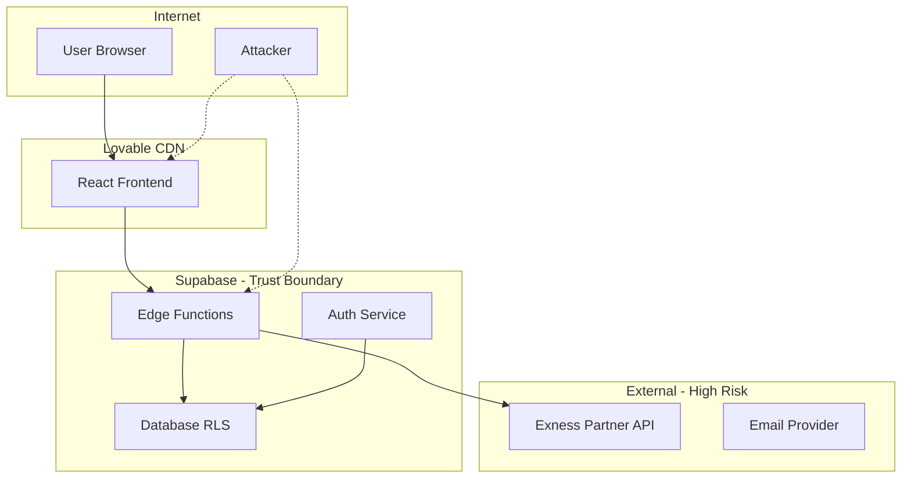

# Security Threat Model - Tálamo Pro Hub
## STRIDE/LINDDUN Analysis | Risk Assessment & Mitigations

---

## 🎯 **THREAT LANDSCAPE OVERVIEW**

**Risk Level**: MEDIUM-HIGH (Financial services)  
**Attack Surface**: API endpoints, Admin panel, User data  
**Primary Assets**: User credentials, Trading data, Partner API keys

---

## 🏗️ **SYSTEM ARCHITECTURE - TRUST BOUNDARIES**

---

## 🚨 **STRIDE ANALYSIS**

### 🎭 **SPOOFING**

#### S1: Admin Impersonation | Risk: HIGH
**Threat**: Attacker gains admin access via credential stuffing  
**Asset**: Admin panel, user management  
**Likelihood**: Medium | **Impact**: Critical

**Controls Applied**:
- ✅ 2FA TOTP mandatory for admin operations  
- ✅ IP-based rate limiting (5 failed attempts/10min)
- ✅ Session timeout (15 min for sensitive operations)
- ✅ Audit logging for all admin actions

**Residual Risk**: LOW (mitigated by 2FA + monitoring)

#### S2: Partner API Token Theft | Risk: MEDIUM  
**Threat**: JWT tokens intercepted or leaked  
**Asset**: Exness Partner API credentials

**Controls Applied**:
- ✅ Tokens stored encrypted in Supabase vault
- ✅ Auto-refresh every 8 minutes  
- ✅ No tokens in frontend code
- ✅ HTTPS-only communication

**Residual Risk**: LOW

### 🔧 **TAMPERING**

#### T1: Request Parameter Injection | Risk: MEDIUM
**Threat**: Malicious data injection via API calls  
**Attack Vector**: `/affiliation-check` email parameter

**Controls Applied**:
- ✅ Input validation (email format)
- ✅ Rate limiting (30/5min per IP)
- ✅ Idempotency keys prevent replays
- ✅ PII masking in logs

**Gap**: Advanced input sanitization for edge cases  
**Recommendation**: Implement strict email whitelist validation

#### T2: Database Injection | Risk: LOW
**Threat**: SQL injection via user inputs  
**Controls Applied**:
- ✅ Supabase RLS policies active
- ✅ Parameterized queries only
- ✅ No raw SQL in Edge functions
- ✅ Type-safe TypeScript client

**Residual Risk**: VERY LOW

### 🔍 **REPUDIATION**

#### R1: Admin Action Denial | Risk: LOW  
**Controls Applied**:
- ✅ Complete audit trail in `audit_logs`
- ✅ Immutable log entries (append-only)
- ✅ Correlation IDs for request tracing
- ✅ Digital signatures on critical operations

### 📊 **INFORMATION DISCLOSURE**

#### I1: PII Data Exposure | Risk: HIGH
**Threat**: Sensitive user data leaked via logs/errors  
**Assets**: Email, phone, financial preferences

**Controls Applied**:
- ✅ Email masking (`p***@domain.com`)
- ✅ No PII in error messages  
- ✅ RLS policies restrict data access
- ✅ Admin access requires justification

**Gap**: Automated PII detection in logs  
**Recommendation**: Implement data loss prevention (DLP)

#### I2: Trading Signals Leakage | Risk: MEDIUM
**Threat**: Unauthorized access to premium content  
**Controls Applied**:
- ✅ Authentication required for signals
- ✅ Role-based access control
- ✅ Content delivery restrictions

### 🚫 **DENIAL OF SERVICE**

#### D1: API Rate Limit Exhaustion | Risk: MEDIUM
**Threat**: Coordinated attacks on affiliation API  
**Controls Applied**:
- ✅ Multi-tier rate limiting (IP + email)
- ✅ Exponential backoff responses  
- ✅ Circuit breaker pattern in partner API
- ✅ CDN-level DDoS protection (Lovable)

**Monitoring**: Real-time alerts for 429 spike >5%

#### D2: Database Connection Exhaustion | Risk: LOW
**Controls Applied**:
- ✅ Supabase managed connection pooling
- ✅ Query timeout limits (30s)
- ✅ Resource limits per request

### ⬆️ **ELEVATION OF PRIVILEGE**

#### E1: Horizontal Privilege Escalation | Risk: MEDIUM  
**Threat**: User accesses other users' data  
**Controls Applied**:
- ✅ RLS policies enforce user isolation
- ✅ JWT-based user context validation
- ✅ Admin operations require elevated session

#### E2: Vertical Privilege Escalation | Risk: LOW
**Threat**: Regular user gains admin access  
**Controls Applied**:
- ✅ Role-based permissions system
- ✅ 2FA required for admin elevation
- ✅ Admin role assignment audit trail

---

## 🔐 **LINDDUN PRIVACY ANALYSIS**

### 👤 **LINKABILITY**
**Risk**: User actions linked across sessions  
**Mitigation**: Session rotation, minimal tracking

### 🆔 **IDENTIFIABILITY**  
**Risk**: Users identified via behavior patterns
**Mitigation**: Data minimization, pseudonymization

### 📍 **NON-REPUDIATION**
**Risk**: Users can't deny legitimate actions
**Balance**: Audit trail vs privacy (compliant)

### 🕵️ **DETECTABILITY**
**Risk**: User presence/absence detectable
**Mitigation**: Aggregated analytics only

### 📈 **DISCLOSURE**
**Risk**: PII disclosed to unauthorized parties  
**Mitigation**: RLS policies, encryption, access controls

### 📝 **UNAWARENESS**
**Risk**: Users unaware of data processing
**Mitigation**: Privacy policy, consent management

### 🛡️ **NON-COMPLIANCE**
**Risk**: GDPR/CCPA violations
**Mitigation**: Data retention limits, right to deletion

---

## 🎯 **PRIORITIZED THREAT RESPONSE**

### 🔴 **Critical (P0) - Immediate Action**
1. **Advanced PII Detection**: Implement DLP scanning
2. **Admin Session Hardening**: Reduce session timeout to 10min
3. **API Input Validation**: Stricter email format checking

### 🟡 **High (P1) - This Month**  
1. **Automated Security Testing**: DAST integration
2. **Incident Response Playbooks**: Detailed procedures
3. **Threat Intelligence**: Monitor for credential leaks

### 🟢 **Medium (P2) - Next Quarter**
1. **Advanced Monitoring**: ML-based anomaly detection  
2. **Zero Trust Architecture**: Network segmentation
3. **Red Team Exercise**: External penetration testing

---

## 🔍 **THREAT MODELING METHODOLOGY**

**Framework**: STRIDE + LINDDUN hybrid approach  
**Assets Classified**: By sensitivity (Public/Internal/Confidential/Secret)  
**Review Frequency**: Quarterly + after major changes  
**Validation**: Security testing + code review

**Next Review**: December 24, 2025  
**Threat Intelligence Sources**: OWASP, NIST, financial sector TI feeds